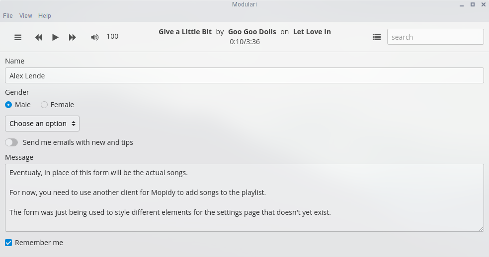

# Modulari

Modulari (Latin) - to modulate, to beat time, to measure, to regulate (as in music :wink::musical_note:)

Eventually the goal is for it to be a full-featured client for [Mopidy](https://www.mopidy.com) built with [Electron](http://electron.atom.io) and [Cycle.js](http://cycle.js.org).

Design is inspired by [museeks](https://github.com/KeitIG/museeks), an electron based music player that plays local files directly.

This project is in its infancy, so many things will be broken or not exist at the moment.

## Progress so far...


Currently you can only control the playback with the previous, play/payse, and next buttons. The current song info is also shown.

## Usage
First, make sure that [Mopidy](https://www.mopidy.com) is installed and running on your computer with the [Mopidy-HTTP](https://docs.mopidy.com/en/latest/ext/http/) extension running. See the [Mopidy Docs](https://docs.mopidy.com/en/latest/) for how to do that.

At the moment you need to add songs to your playlist with another [Mopidy Client](https://docs.mopidy.com/en/latest/clients/http/)

Next, run the following in the `mopidy` directory:

```sh
$ npm install -g electron-prebuilt less eslint
$ npm install
$ npm run less
$ npm start
```
